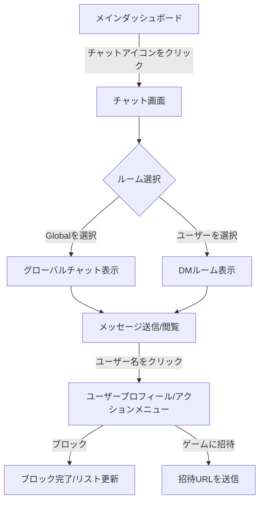
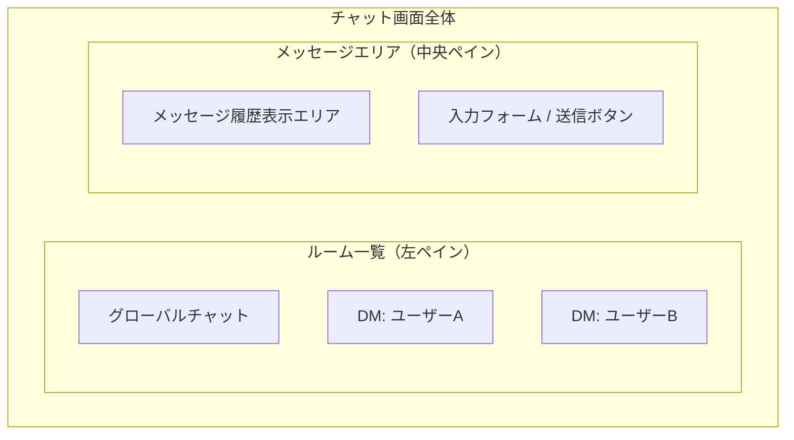

# チャットシステム 画面仕様 (UI/UX)

## 1. 画面遷移図 (Screen Flow)
ユーザーがチャット機能を利用する際の流れです。

## 2. 画面レイアウト案 (Wireframe)
SPA内でのチャットコンポーネントの配置です。

## 3. 各画面の詳細仕様

### 3.1 ルーム一覧 (SideBar)
- **Global Chat**: 常に最上部に固定。
- **DMリスト**: 直近でやり取りのあった順に表示。
- **オンライン状態**: ユーザー名の横にインジケーター（緑点など）を表示。

### 3.2 メッセージエリア (MainChat)
- **自分/相手の区別**: 吹き出しの左右配置。
- **ゲーム招待メッセージ**: 特殊なスタイルのカードとして表示（「対戦する」ボタン付き）。
- **リアルタイム更新**: 新着メッセージがあれば自動で最下部へスクロール。
