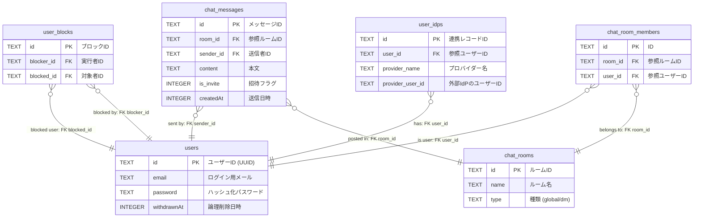

# ft_transcendence — Data Structure

## 1. データモデル

### 1.1 users (ユーザーアカウント)

| カラム名 | データ型 (SQLite) | 制約              | 意味 / 備考                             |
| ----------- | ------------- | --------------- | ---------------------------           |
| id          | TEXT          | PRIMARY KEY     | ユーザーの一意な識別子（UUID）             |
| email       | TEXT          | NOT NULL UNIQUE | ログインID・通知に使用                    |
| password    | TEXT          | NOT NULL        | ハッシュ化されたパスワード                 |
| username    | TEXT          | NOT NULL UNIQUE | アプリケーション内の表示名                 |
| imagePath   | TEXT          | -               | プロフィール画像へのパス                   |
| createdAt   | INTEGER       | NOT NULL        | 作成時 Unix Time                        |
| updatedAt   | INTEGER       | NOT NULL        | 更新時 Unix Time                        |
| withdrawnAt | INTEGER       | -               | **論理削除（退会日時）**。NULLなら有効ユーザー |

### 1.2 user_idps (ユーザーIDプロバイダー連携情報)

| カラム名             | データ型 (SQLite) | 制約                   | 意味 / 備考                 |
| ---------------- | ------------- | -------------------- | -------------------------         |
| id               | TEXT          | PRIMARY KEY          | 連携レコードID（UUID）               |
| user_id          | TEXT          | FOREIGN KEY NOT NULL | `users.id` を参照                  |
| provider_name    | TEXT          | NOT NULL             | 認証プロバイダー名（google / 42 など） |
| provider_user_id | TEXT          | NOT NULL UNIQUE      | 外部プロバイダー側のユーザーID         |
| imagePath        | TEXT          | -                    | プロフィール画像へのパス              |
| createdAt        | INTEGER       | NOT NULL             | 作成時 Unix Time                   |
| updatedAt        | INTEGER       | NOT NULL             | 更新時 Unix Time                   |
| withdrawnAt      | INTEGER       | -                    | **論理削除（退会日時）**。NULLなら有効ユ |

**UNIQUE constraint:**
`UNIQUE(provider_name, provider_user_id)`

### 1.3 chat_rooms (チャットルーム)

| カラム名 | データ型 | 制約 | 意味 / 備考 |
| :--- | :--- | :--- | :--- |
| id | TEXT | PRIMARY KEY | ルームID (UUID) |
| name | TEXT | - | ルーム表示名（グローバル等） |
| type | TEXT | NOT NULL | 'global' / 'dm' |
| createdAt | INTEGER | NOT NULL | 作成日時 (Unix Time) |

### 1.4 chat_room_members (ルームメンバー)

| カラム名 | データ型 | 制約 | 意味 / 備考 |
| :--- | :--- | :--- | :--- |
| id | TEXT | PRIMARY KEY | 一意識別子 (UUID) |
| room_id | TEXT | FK, NOT NULL | `chat_rooms.id` を参照 |
| user_id | TEXT | FK, NOT NULL | `users.id` を参照 |
| createdAt | INTEGER | NOT NULL | 参加/作成日時 (Unix Time) |

**Constraints:**
- `UNIQUE(room_id, user_id)`: 重複参加の防止
- `FOREIGN KEY (room_id) REFERENCES chat_rooms(id) ON DELETE CASCADE`
- `FOREIGN KEY (user_id) REFERENCES users(id) ON DELETE CASCADE`

### 1.5 chat_messages (チャットメッセージ)

| カラム名 | データ型 | 制約 | 意味 / 備考 |
| :--- | :--- | :--- | :--- |
| id | TEXT | PRIMARY KEY | メッセージ名 (UUID) |
| room_id | TEXT | FK, NOT NULL | `chat_rooms.id` を参照 |
| sender_id | TEXT | FK, NOT NULL | `users.id` (送信者) を参照 |
| content | TEXT | NOT NULL | 本文（または招待データ） |
| is_invite | INTEGER | NOT NULL DEFAULT 0 | 1=招待, 0=通常メッセージ |
| createdAt | INTEGER | NOT NULL | 送信日時 (Unix Time) |

**Constraints:**
- `FOREIGN KEY (room_id) REFERENCES chat_rooms(id) ON DELETE CASCADE`
- `FOREIGN KEY (sender_id) REFERENCES users(id) ON DELETE CASCADE`

### 1.6 user_blocks (ブロック管理)

| カラム名 | データ型 | 制約 | 意味 / 備考 |
| :--- | :--- | :--- | :--- |
| id | TEXT | PRIMARY KEY | 一意識別子 (UUID) |
| blocker_id | TEXT | FK, NOT NULL | `users.id` (実行者) |
| blocked_id | TEXT | FK, NOT NULL | `users.id` (対象者) |
| createdAt | INTEGER | NOT NULL | ブロック日時 (Unix Time) |

**Constraints:**
- `UNIQUE(blocker_id, blocked_id)`
- `FOREIGN KEY (blocker_id) REFERENCES users(id)`
- `FOREIGN KEY (blocked_id) REFERENCES users(id)`

## 2. リレーションシップ（関係）

