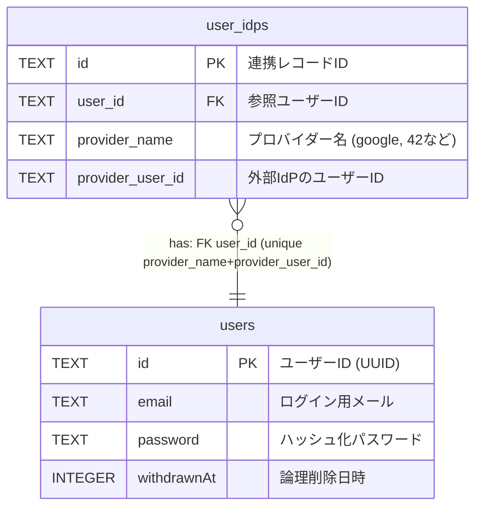

# ft_transcendence — Data Structure

## 1. データモデル

### 1.1 users (ユーザーアカウント)

| カラム名 | データ型 (SQLite) | 制約              | 意味 / 備考                             |
| ----------- | ------------- | --------------- | ---------------------------           |
| id          | TEXT          | PRIMARY KEY     | ユーザーの一意な識別子（UUID）             |
| email       | TEXT          | NOT NULL UNIQUE | ログインID・通知に使用                    |  
| password    | TEXT          | NOT NULL        | ハッシュ化されたパスワード                 |
| username    | TEXT          | NOT NULL UNIQUE | アプリケーション内の表示名                 |
| imagePath   | TEXT          | -               | プロフィール画像へのパス                   |
| createdAt   | INTEGER       | NOT NULL        | 作成時 Unix Time                        |
| updatedAt   | INTEGER       | NOT NULL        | 更新時 Unix Time                        |
| withdrawnAt | INTEGER       | -               | **論理削除（退会日時）**。NULLなら有効ユーザー |

### 1.2 user_idps (ユーザーIDプロバイダー連携情報)

| カラム名             | データ型 (SQLite) | 制約                   | 意味 / 備考                 |
| ---------------- | ------------- | -------------------- | -------------------------         |
| id               | TEXT          | PRIMARY KEY          | 連携レコードID（UUID）               |
| user_id          | TEXT          | FOREIGN KEY NOT NULL | `users.id` を参照                  |
| provider_name    | TEXT          | NOT NULL             | 認証プロバイダー名（google / 42 など） |
| provider_user_id | TEXT          | NOT NULL UNIQUE      | 外部プロバイダー側のユーザーID         |
| imagePath        | TEXT          | -                    | プロフィール画像へのパス              |
| createdAt        | INTEGER       | NOT NULL             | 作成時 Unix Time                   |
| updatedAt        | INTEGER       | NOT NULL             | 更新時 Unix Time                   |
| withdrawnAt      | INTEGER       | -                    | **論理削除（退会日時）**。NULLなら有効ユ |

**UNIQUE constraint:**  
`UNIQUE(provider_name, provider_user_id)`

## 2. リレーションシップ（関係）

